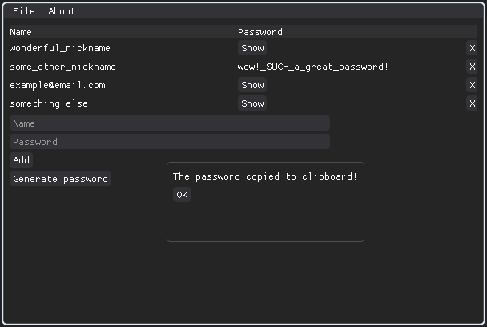

# wordman

<div align="center">




</div>

A password manager written in Python using Dear PyGUI as a practice project in late May-June 2023. I am not an expert in cryptography, hence **cryprographical security is not guarranteed, use after your own risk!** I do not hold any responsibility. MIT-licensed.

## Building
```
git clone https://github.com/kitrofimov/wordman/
cd wordman
poetry install
poetry run python main.py
```

## Contributions
The project is pretty much finished, but any contributions (issues, pull requests) are welcome!

### Linting
```bash
poetry run ruff check .
poetry run black .
poetry run isort .
```
